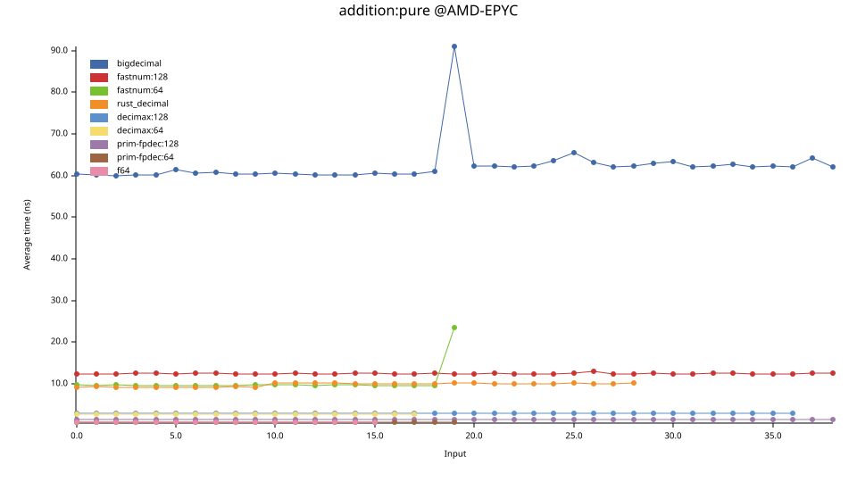
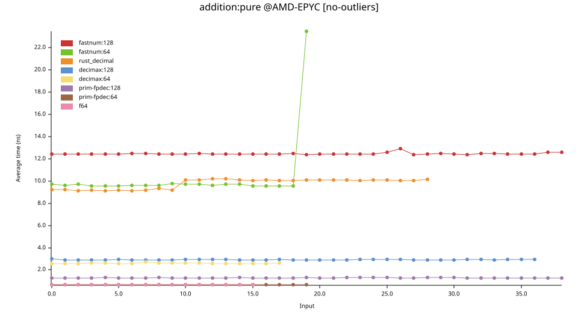
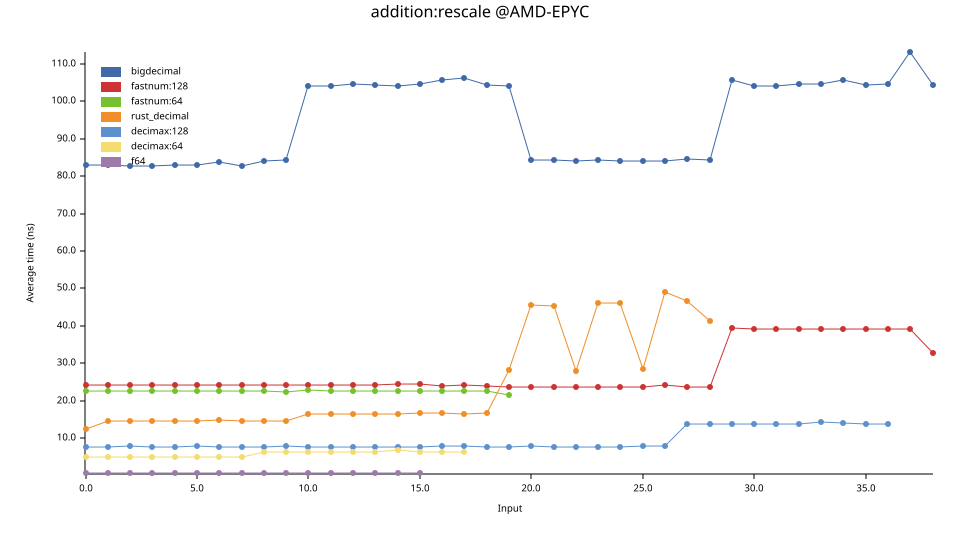
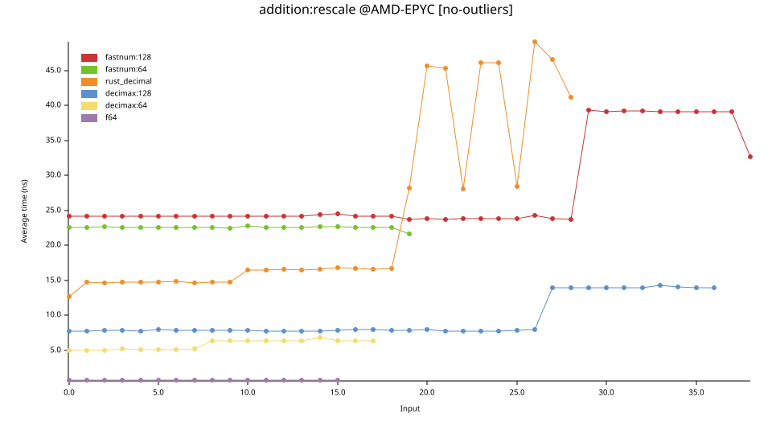
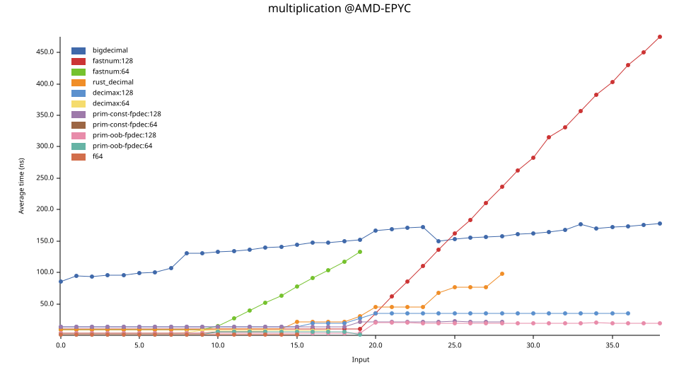
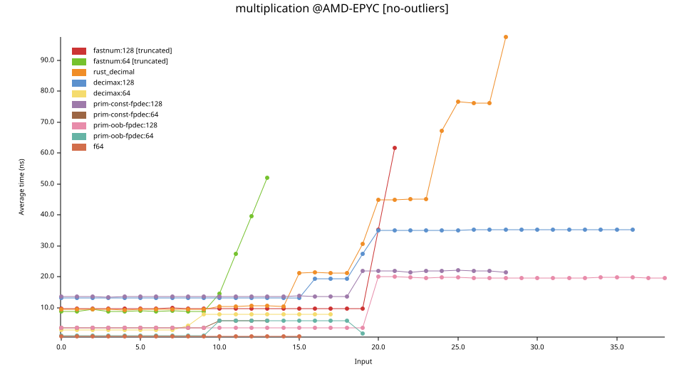
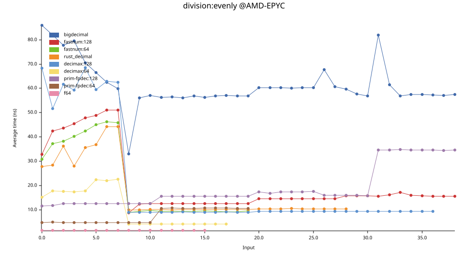
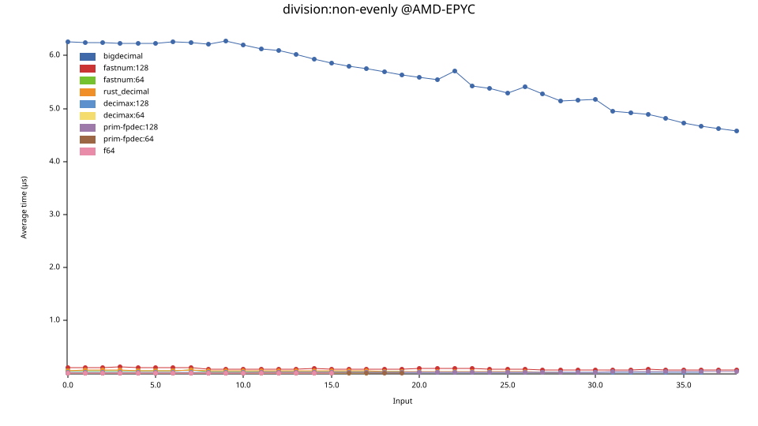
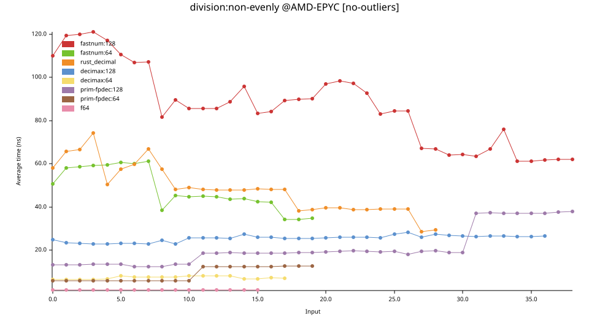

# Comparison and Benchmarking of Rust Decimal Crates


As is well known, because 2 and 10 do not share the same prime factors, binary
fractions cannot represent decimal fractions exactly. For example, `f32` has
the classic arithmetic error: `0.1 + 0.2 != 0.3`.

Some application scenarios, such as finance, require exact representation of
decimal fractions. This is why decimal crates are needed. Their use integers to
represent the mantissa, along with a scale representing the number of decimal
places. For example, the value `1.23` can be represented using integer `123`
with `scale = 2`.

There are many decimal crates in the Rust ecosystem, each with different designs
and trade-offs. Their differences mainly fall into two dimensions:

1. Whether the scale is fixed or variable. This corresponds to
[Fixed-point](https://en.wikipedia.org/wiki/Fixed-point_arithmetic)
vs [Floating-point](https://en.wikipedia.org/wiki/Floating-point_arithmetic).

2. Whether the count of integers is fixed or arbitrary. This corresponds to
[Fixed-precision](https://en.wikipedia.org/wiki/Fixed-precision_arithmetic)
vs [Arbitrary-precision](https://en.wikipedia.org/wiki/Arbitrary-precision_arithmetic).

This article chooses several crates for comparison and benchmarking.

Table of contents:

- The first two sections ([Fixed-point and Floating-point](#fixed-point-and-floating-point),
  [Fixed-size and Arbitrary-precision](#fixed-size-and-arbitrary-precision))
  introduce the characteristics of these categories. There is nothing
  particularly new here, so experienced readers may skip them.

- The next section ([Choosing Crates](#choosing-crates)) introduces several
  decimal crates.

- The final section ([Benchmark Comparison](#benchmark-comparison)) is the
  main focus of this article, benchmarking and comparing these crates.


## Fixed-point and Floating-point

*[Fixed-point](https://en.wikipedia.org/wiki/Fixed-point_arithmetic)* vs *[Floating-point](https://en.wikipedia.org/wiki/Floating-point_arithmetic)*.

In fixed-point arithmetic, the scale is fixed and bound to the type. In
floating-point arithmetic, the scale is variable and stored in each instance.

Let's illustrate this with code.

A typical *fixed-point* type definition might look like this:

```rust
struct FixedPoint<const SCALE: i32>(i128); // scale is bound to type
```

A typical *floating-point* decimal type might look like this:

```rust
struct FloatingPoint {
    mantissa: i128,
    scale: i32, // scale is stored in each instance
}
```

This clearly shows that fixed-point numbers have fixed decimal precision, while
floating-point decimals have variable precision. For example, `FixedPoint<2>`
always has 2 decimal places, while the precision of `FloatingPoint` depends
on each instance's scale.

Because of this distinction, fixed-point and floating-point types exhibit
the following differences:

1. Fixed-point numbers have a smaller representable range, while floating-point
numbers can represent a much larger range. This is because floating-point
numbers sacrifice decimal precision as values become larger.

2. Fixed-point arithmetic is simpler and faster, while floating-point arithmetic
is more complex and slower. For example, addition for fixed-point numbers only
requires integer addition on the mantissa. Floating-point addition must first
check whether the scales are equal (this check itself can already be slower
than the addition), and if not, align the scales through multiplication. This
will be discussed in detail in the benchmark section.

3. Fixed-point arithmetic is somewhat more cumbersome to use, while floating-point
arithmetic is more convenient. For example, with the `FixedPoint` type above,
the scale must be determined at compile time for each type, such as how many
decimal places `Balance` or `Price` should have. Floating-point decimals do
not require this consideration.

The difference between the two is somewhat analogous to the difference between
statically typed and dynamically typed languages.

Most applications use decimal crates simply to represent decimal fractions exactly,
without particularly high requirements for performance or strict decimal precision.
In such cases, floating-point decimals are usually preferred for convenience.
However, for more serious services, especially many financial systems that require
strict decimal precision or high performance, fixed-point decimals are recommended.
For example, USD assets should have exactly 2 decimal places, neither more nor less.

NOTE: Since built-in floating-point types in programming languages (such as C's
`float` and `double`, or Rust's `f32` and `f64`) are commonly referred to as
"floating-point", and these types cannot represent decimal fractions exactly,
many people mistakenly think that "floating-point" inherently cannot represent
decimal fractions exactly. This is WRONG! More precisely, these are "binary
floating-point" numbers. The inability to represent decimal fractions exactly
comes from the "binary" part, not the "floating-point" part. Because people
often omit the word "binary", floating-point arithmetic unfairly gets blamed.
In fact, even *binary fixed-point* types, such as the
[`fixed`](https://docs.rs/fixed/latest/fixed/) crate, also cannot represent
decimal fractions exactly. As long as a crate is decimal-based, whether
fixed-point or floating-point, it can represent decimal fractions exactly.

NOTE: Floating-point arithmetic has a standard called
[IEEE 754](https://en.wikipedia.org/wiki/IEEE_754), which defines both binary
floating-point formats (used by `f32`/`f64`) and decimal floating-point formats.
However, this standard is only *one* implementation approach for floating-point
arithmetic, not the entirety of floating-point arithmetic itself. Other
implementations are also possible. In practice, most decimal crates do not
follow IEEE 754 decimal formats.


## Fixed-size and Arbitrary-precision

*[Fixed-precision](https://en.wikipedia.org/wiki/Fixed-precision_arithmetic)* vs
*[Arbitrary-precision](https://en.wikipedia.org/wiki/Arbitrary-precision_arithmetic)*.

First, let's clarify the meaning of the word "precision" here. The term has two conflicting meanings:

- Number of fraction places
- Number of significant digits

For example, the value `1.23` has 2 fraction places but 3 significant digits.
Both meanings are widely used. For example,
[std::fmt](https://doc.rust-lang.org/std/fmt/index.html#precision) uses the
former meaning, while here (Fixed-precision vs Arbitrary-precision) the latter
meaning is used. This is the [standard terminology](https://en.wikipedia.org/wiki/Fixed-precision_arithmetic),
but it easily causes confusion. "Fixed-precision" is often misunderstood as
fixed fraction places, leading to confusion with fixed-point arithmetic.

To avoid ambiguity, this article uses the term *Fixed-size* instead of *Fixed-precision*.

As the name suggests, Fixed-size types use a fixed number of integers (one or more).
Arbitrary-precision types use as many integers as necessary: expanding to the
left to avoid overflow, and expanding to the right to avoid precision loss.

Naturally, this requires heap allocation, meaning the type is not `Copy`,
and the crate is not `no-alloc`. All operations also become significantly slower.
Unless there is a clear requirement for arbitrary precision, Fixed-size types
are generally preferable.


## Choosing Crates

We choose several decimal crates for comparison and benchmarking:

- bigdecimal
- fastnum
- rust_decimal
- decimax
- primitive_fixed_point_decimal

### crate: bigdecimal

Floating-point | Arbitrary-precision

This is currently the only actively maintained Arbitrary-precision decimal crate.
Internally, it uses a `Vec<u64>` or `Vec<u32>` to represent the mantissa.
Its memory layout looks like this:

```text
+-u64----+--------+--------+--------+--------+
| sign   | Vec<u64>                 | scale  |
+--------+--+-----+--------+--------+--------+
            |
            +--------+--------+----
            | u64    |  …     |
            +--------+--------+----
```

Metadata alone occupies 5 machine words, totaling 40 bytes, making the memory
layout relatively loose. Since memory allocation is required during creation
and expansion, and pointer dereferencing is needed during access, performance
is relatively poor, as will be clearly shown in the benchmarks below.

In short, this crate prioritizes Arbitrary-precision at the expense of memory
efficiency and performance.

### crate: fastnum

Floating-point | Fixed-size

Its `Decimal` definition is:

```rust
struct Decimal<const N: usize>
```

Here, `N` is the number of `u64`s used to represent the mantissa. For example,
`Decimal<2>` uses two `u64`s, giving a 128-bit mantissa. This is why its
documentation also describes it as [Arbitrary-precision](https://crates.io/crates/fastnum/0.7.4).
The difference is that `bigdecimal` adjusts precision at runtime, while
`fastnum` determines it at compile time.

The memory layout is:

```text
+-u64----+--------+...+--------+
| [u64; N]            | CBlock |
+--------+--------+...+--------+
```

`CBlock` is an 8-byte `ControlBlock` used by `fastnum` to store metadata.
Besides sign and scale, it contains additional fields. See the
[documentation](https://docs.rs/fastnum/0.7.4/fastnum/#memory-layout) for details.

`fastnum` also provides many scientific functions typically found in `f32`/`f64`,
such as `sin`, `cos`, `sqrt`, and `log`. None of the other decimal crates provide
such functionality. Personally, I do not think these features are particularly
reasonable. People use decimal arithmetic to represent decimal fractions exactly,
while scientific computations typically produce irrational numbers that cannot be
represented exactly anyway. Scenarios requiring such operations (even in finance,
such as pricing models) are better suited to much faster binary floating-point
types (`f32`/`f64`).

The documentation claims the crate is [blazing fast](https://docs.rs/fastnum/0.7.4/fastnum/#why-fastnum),
but its benchmark comparisons are mostly against the already slow `bigdecimal`.
In the benchmarks below, compared to the other selected crates, `fastnum` turns
out to be the slowest. However, since it considers itself Arbitrary-precision,
its intended competitor is probably `bigdecimal`.

Also, its documentation is extremely detailed.

### crate: rust_decimal

Floating-point | Fixed-size

The most popular decimal crate in the Rust ecosystem. Judging from download counts,
reverse dependencies, and ecosystem integration (serde, postgres, etc.), it is
by far the most widely used. It is also one of the oldest decimal crates, with
its first release dating back to late 2016. Its age is probably a major reason
for its popularity.

It only supports 128-bit signed decimals. Memory layout:

```text
+-u32--+------+------+------+
| flag | high | mid  | low  |
+------+------+------+------+
```

The mantissa consists of three `u32`s (`high`, `mid`, and `low`), totaling 96 bits,
roughly equivalent to 28 decimal digits. Arithmetic operations must process all
three `u32`s sequentially, which hurts performance.

The `flag` field stores:

- 1 bit for sign
- 5 bits for scale (range `[0, 28]`)
- remaining bits reserved

The documentation claims this memory layout is chosen for
[performance optimization](https://docs.rs/rust_decimal/1.41.0/rust_decimal/#comparison-to-other-decimal-implementations).
However, the benchmarks below show that `rust_decimal` is not actually the fastest.
Historically, this design likely existed because Rust originally lacked stable
128-bit integers.

The API also reveals traces of the pre-`i128` era. For example, the constructor
from `i64` is called [`new`](https://docs.rs/rust_decimal/latest/rust_decimal/struct.Decimal.html#method.new),
while the later-added `i128` constructor is named
[`from_i128_with_scale`](https://docs.rs/rust_decimal/latest/rust_decimal/struct.Decimal.html#method.from_i128_with_scale).

### crate: decimax

Floating-point | Fixed-size

This crate occupies essentially the same niche as `rust_decimal`.

Advantages:

- Faster (see benchmarks below)
- More types: 128/64/32-bit, signed and unsigned
- More compact memory layout and more significant digits

Disadvantages:

- It is a much newer crate and lacks the extensive ecosystem integration of `rust_decimal`.

One reason this crate was selected is that I am its author :)

It uses a single integer representation. For the 128-bit signed type,
the memory layout is:

```text
+-u128-----------------------+
|S|scale| mantissa           |
+----------------------------+
```

The sign (`S`) and scale occupy 1 bit and 5 bits respectively, leaving 122 bits
for the mantissa, or roughly 36 decimal digits — significantly more than
`rust_decimal`'s 28 digits.

Arithmetic uses a single `u128` instead of three `u32`s, making it faster.

### crate: primitive_fixed_point_decimal

Fixed-point | Fixed-size

This is the only Fixed-point crate selected in this article. Its main difference
from the others is precisely that it is Fixed-point, as discussed earlier
in [Fixed-point and Floating-point](#fixed-point-and-floating-point).

Compared with other Fixed-point decimal crates, its biggest feature is that
besides the typical `FixedPoint` style (using const generics to fix decimal
places at compile time), it also provides an *Out-of-band scale* mode,
allowing the scale to be specified at runtime for greater flexibility.

For example, in a multi-currency fund management system, using the typical
`FixedPoint` type forces all currencies to share the same decimal precision.
Defining:

```rust
type Balance = FixedPoint<2>
```

means all currencies are limited to 2 decimal places.

With the crate's `Out-of-band scale` types, each currency can define its own
decimal precision. See the [Out-of-band documentation](https://docs.rs/primitive_fixed_point_decimal/latest/primitive_fixed_point_decimal/#specify-scale)
for details.

Since the scale is bound to the type (either through const generics or
Out-of-band metadata), no scale needs to be stored in the instance itself.
Therefore, instances only store the mantissa. For the 128-bit signed type,
the memory layout is:

```text
+-i128-----------------------+
| signed-mantissa            |
+----------------------------+
```

This crate also differs in another implementation detail: it uses signed
mantissas, while all the other selected crates separate sign and mantissa
handling. This distinction also originates from the difference between
floating-point and fixed-point arithmetic, but we will not go into detail
here. The only thing worth noting is that this leaves the mantissa with
127 bits instead of 128.

### Memory Comparison

Let's compare memory efficiency by looking at metadata size:

- bigdecimal: 5 machine words, 40 bytes
- fastnum: 8 bytes
- rust_decimal: 4 bytes
- decimax: 6 bits (for the 128-bit signed type)
- primitive_fixed_point_decimal: 1 bit

Spoiler: this ranking matches the benchmark results.


## Benchmark Comparison

Now we arrive at the core of this article: benchmark results.

We use [criterion](https://crates.io/crates/criterion) for benchmarking.
The project source code is available on [GitHub](https://github.com/WuBingzheng/decimal-crates-comparison).

Benchmarks were run on three machines:

- Ubuntu 22.04 @ AMD EPYC 9754
- Ubuntu 16.04 @ Intel Xeon, 2500 MHz
- macOS 13.5 @ Apple M1

Results vary somewhat across environments. For simplicity, this article only
presents and analyzes the first machine (AMD EPYC). Readers interested in other
environments can refer to the [full results](https://github.com/WuBingzheng/decimal-crates-comparison/tree/main/charts).
You are also welcome to run the benchmarks on your own machine; instructions
are included in the project's page.

Besides the decimal crates above, native Rust `f64` is also included for
comparison. Since stable `f128` is not yet available, it was not benchmarked.
However, in my private tests, `f128` performs almost identically to `f64`.

We primarily benchmark 128-bit and 64-bit signed types. However:

- `bigdecimal` is variable-sized, so bit width is irrelevant.
- `fastnum` supports much larger sizes, making this benchmark somewhat underutilize it.
- `rust_decimal` only supports 128-bit, not 64-bit.

Benchmark cases:

- Addition with equal scales
- Addition with different scales
- Multiplication
- Exactly divisible division
- Non-exact division

Subtraction behaves similarly to addition and is therefore omitted.

Operand selection: Different benchmark cases use different scale configurations
depending on the scenario. The mantissas themselves (more precisely: both addition
operands, both multiplication operands, and the dividend for division) are all
powers of 10, increasing exponentially. For example, `x = 3` on the chart
means the operand is `1e3`.

Because different crates support different mantissa sizes, their representable
ranges differ, resulting in different line lengths in the charts:

- `bigdecimal` supports arbitrary precision, but was restricted here to 128-bit-equivalent values, or 38 decimal digits.
- `fastnum:128` has a full 128-bit mantissa, also about 38 digits.
- `prim-fpdec:128` has a 127-bit mantissa, but still roughly 38 decimal digits.
- `decimax:128` has a 122-bit mantissa, about 36 digits.
- `rust_decimal` has a 96-bit mantissa, only about 28 digits.
- The 64-bit variants behave similarly.

The following sections explain the details.


### Benchmark: Addition with Equal Scales

The addition process works as follows:

1. Check whether the scales of the two operands are equal.
2. If equal, directly add the mantissas.
3. Otherwise, align the scales first, then add.

This section benchmarks the equal-scale case. The next section covers unequal scales.

For simplicity, we use identical operands. The scale does not affect the benchmark
and is fixed at 10. The mantissas are powers of 10 increasing in magnitude.

Chart:



As expected, `bigdecimal` sits far above the others. The remaining crates
are compressed near the bottom, so we temporarily remove `bigdecimal`:



Now things are much clearer.

For 128-bit types:

- `fastnum:128` is the slowest
- `rust_decimal` comes next
- `decimax` follows
- `prim-fpdec:128` is the fastest, approaching the measurement limit (criterion seems unable to measure below about 0.35 ns)

The first three are floating-point decimals, so they must first check whether
the scales are equal before addition. This check itself is relatively expensive
and slows down the entire operation.

`prim-fpdec:128` is fixed-point, so the operation is essentially just integer
addition, almost a single CPU instruction.

For 64-bit types:

- `fastnum:64` is slightly faster than `fastnum:128`
- `decimax:64` performs similarly to `decimax:128`
- `prim-fpdec:64` performs similarly to `prim-fpdec:128`

Most curves are stable, except `rust_decimal` and `fastnum:64`, both of which
exhibit noticeable jumps, though for different reasons:

For `rust_decimal`, the jump occurs because numbers are internally represented
using three `u32`s. Small mantissas fitting within one `u32` only require one
addition, while larger mantissas require operations across all three `u32`s.
Hence the jump around `x = 9`.

For `fastnum:64`, the jump occurs because its 64-bit mantissa can represent up
to 19 decimal digits. Since our benchmarks use powers of 10, the problematic
case occurs around `1e19`. Adding two such values yields `2e19`, exceeding the
64-bit range (~`1.84e19`). Following floating-point behavior, the implementation
must rescale: `mantissa /= 10; scale += 1;` . Since division is slow, the
addition operation suddenly becomes much slower.
Other floating-point crates may encounter similar situations, though not within
this benchmark range. Fixed-point crates cannot rescale, so they simply overflow
and return an error instead.


### Benchmark: Addition with Different Scales

Now let's look at addition where the operand scales differ.

Fixed-point types cannot participate in this benchmark, so `primitive_fixed_point_decimal`
is excluded.

Before adding mantissas, floating-point decimals must first align the scales.
The algorithm typically works as follows:

1. Attempt to increase the smaller-scale operand by multiplying its mantissa by a power of 10.
2. If multiplication does not overflow, alignment succeeds.
3. Otherwise, choose a compromise scale and adjust both operands: one scale increases,
the other decreases. Increasing scale requires multiplication; decreasing scale
requires division.

In this benchmark, operand scales are fixed at 10 and 0, differing by 10.
Therefore, alignment requires multiplying by `1e10`. Once the mantissa grows
beyond `1e(MAX_SCALE - 10)`, multiplication overflows and the slower fallback
path involving division is triggered.

Chart:



Again, `bigdecimal` dominates the chart, so we temporarily remove it:



Compared with equal-scale addition, absolute times are much slower because of scale alignment.

As explained above, all curves eventually exhibit jumps.

Among them:

- `rust_decimal` shows the largest jump, tripling from ~15ns to ~45ns and becoming unstable afterward.
- `fastnum:128` shows a moderate jump.
- `decimax:128` shows the smallest jump.

Performance ranking (slower first):

Before the jump:

`fastnum:128` >  `rust_decimal` > `decimax:128`

After the jump:

`rust_decimal` >  `fastnum:128` >  `decimax:128`


### Benchmark: Multiplication

Now let's examine multiplication.

Decimal multiplication consists of two parts:

1. Multiply the mantissas;
2. Add the scales.

Both steps may overflow. If either overflows, a second phase is triggered,
reducing both mantissa and scale to avoid overflow. Since division is
involved, performance degrades significantly.

We again use identical operands with exponentially increasing mantissas.
To avoid overflow of the decimal value itself multiplication (not the mantissa
multiplication), scales are increased simultaneously so that the actual
value remains 1.

Once the mantissa reaches approximately half the representable range,
mantissa multiplication overflows and triggers the second phase.

Chart:



Besides `bigdecimal`, both `fastnum` curves become extremely large in the
latter half. To better observe the other crates, we remove the entire
`bigdecimal` curve and truncate the `fastnum` curves:



The chart is still somewhat messy, so let's break it down carefully.

Because of mantissa multiplication overflow, most curves exhibit jumps
around their midpoint.

First, consider the post-jump behavior for 128-bit types:

- `fastnum:128` slows down extremely rapidly after the jump.
- `rust_decimal` exhibits multiple jumps, likely because of its three-`u32` representation.
- `decimax` and `prim-oob-fpdec:128` are much more stable and significantly faster.

Now consider the pre-jump region:

- `fastnum:128` and `rust_decimal` are both stable before their jumps (`x=19` and `x=14` respectively), though `fastnum` survives longer.
- `decimax` and `prim-oob-fpdec:128` are not only stable but extremely fast before their jumps, appearing nearly as fast as `f64` (~0.35ns).

Careful readers may notice that `primitive_fixed_point_decimal` appears as two variants:
`prim-oob-fpdec:128` and `prim-const-fpdec:128`. Only the former was discussed earlier.
This difference arises from fixed-point semantics. The multiplication process described
earlier (multiply mantissas, add scales) applies to floating-point decimals. For fixed-point
decimals, however, the result scale is predetermined. After adding operand scales, the
implementation must further adjust to the target scale, similar to the
overflow-adjustment phase. In other words, the second phase that floating-point types
only enter later is always active for fixed-point types. This is somewhat unfair to
fixed-point arithmetic. Fortunately, `primitive_fixed_point_decimal` provides the more
flexible `Out-of-band Scale` mode, allowing the result scale to equal the sum of operand
scales. This avoids the second phase during the early part of the benchmark, enabling
fairer comparison with floating-point types. That is what `prim-oob-fpdec:128` measures.

However, this is not the real-world use case for fixed-point arithmetic. The `Out-of-band Scale`
feature was not designed specifically for this benchmark. To reflect realistic fixed-point
usage, we also benchmark `prim-const-fpdec:128`, where the result scale remains fixed,
forcing the second phase throughout the entire benchmark.
As the chart shows, `prim-const-fpdec:128` is initially the slowest, later it becomes
one of the fastest, converging with `prim-oob-fpdec:128`

Does this mean fixed-point multiplication is slower than floating-point multiplication
for small mantissas? For this specific case, yes. But over longer computation chains,
not necessarily. Floating-point multiplication appears faster because it postpones
scale adjustment, allowing both scale and mantissa to grow. As shown throughout this
article, larger scales and mantissas tend to slow down subsequent operations. Unless
the multiplication result is final and never used again (not even formatted as a string),
the earlier performance advantage tends to be paid back later.

The 64-bit results behave similarly and are omitted here.


### Benchmark: Exactly Divisible Division

Division has several notable characteristics:

- Division is relatively rare in real-world decimal arithmetic usage.
- It is extremely slow because integer division itself is slow, and floating-point decimal division requires complicated quotient precision handling.
- Benchmark results vary significantly across CPUs.
- Implementations contain many branching paths, and optimizations often conflict with one another.

Overall, division tends to consume disproportionate development and benchmarking
effort for a relatively small portion of real-world usage.
Therefore, this article only benchmarks two simple cases:

- exactly division
- non-exactly division

without attempting exhaustive or perfectly fair comparison.

This section discusses the former, exactly division.

For exactly divisible floating-point division, there are again two subcases:

1. Mantissas divide evenly directly. Example: `200 / 25`.
2. The dividend must first be rescaled. Example: `2 / 25`.

In the second case, `2` does not divide evenly by `25`, but after rescaling to `200`,
division succeeds. The difficulty is that the implementation initially does not know:
how much rescaling is needed, or whether exact division is even possible.
Therefore, implementations often: first aggressively scale up, then perform division,
and strip trailing zeros afterward finally.
For example, `2` might first become `20000000000`, producing `800000000`, and only
afterward get reduced back to `8`. Even the zero-stripping phase must be discovered
iteratively, making this path potentially very slow.

To cover both cases, the benchmark fixes the divisor at `1e8`, while the dividend
again increases as powers of 10.

Thus:

- before `x=8`, rescaling is required (slow path)
- after `x=8`, direct division succeeds (fast path)

Fixed-point types do not have these distinctions because quotient scale is predetermined.

Chart:



For floating-point types:

- Before `x=8`, all implementations are very slow.
- Afterward, `rust_decimal`, `fastnum:128`, and `decimax` become much faster, while `bigdecimal` remains slow.

For fixed-point:

- `prim-fpdec:128` avoids quotient-scale determination and is initially very fast.
Later, larger mantissas gradually slow it down.

### Benchmark: Non-Exactly Divisible Division

Now consider the non-exact division case.

As explained above, exactness only matters for floating-point decimals. Fixed-point
behavior remains unchanged, so the fixed-point results here should match the previous benchmark.

Chart:



Again, removing `bigdecimal` makes the comparison clearer:



Compared with their exact-division counterparts:

- `bigdecimal`, `fastnum:128`, and `rust_decimal` are consistently much slower.
- `decimax:128` becomes significantly faster and very stable.
- `prim-fpdec:128`, being fixed-point, behaves identically to the exact-division benchmark.

The reasons likely require code-level analysis of each implementation and are beyond the
scope of this article.


### Benchmark Summary

Overall, except for a few special cases, the approximate performance ranking is:

```text
bigdecimal << fastnum < rust_decimal < decimax < primitive_fixed_point_decimal
```

(Further left means slower.)

Floating-point arithmetic paths depend heavily on the specific operands, making
performance relatively unstable. Fixed-point arithmetic, by comparison, is much
more predictable, which is reflected in the mostly flat curves above.

Again, it is important to emphasize that these crates target different use cases,
so pure performance comparison is not entirely fair.


## Conclusion

This article introduced several categories of decimal crates and benchmarked
several representative implementations.

Based on the results, the following recommendations can be made:

- If dynamic arbitrary precision is required, `bigdecimal` is the only option,
at the cost of losing `Copy` semantics and suffering very poor performance.

- If types larger than 128-bit are required, `fastnum` is the only choice.
This article does not benchmark larger-than-128-bit types, but performance is
unlikely to be excellent. Interested readers can modify the benchmark project and test it themselves.

- If fixed decimal precision is required, `primitive_fixed_point_decimal` is
the only suitable option. Although slightly less convenient than floating-point
types, it provides higher and more stable performance.

- If none of the above requirements apply and you simply want exact decimal
representation, `rust_decimal` or `decimax` are both good choices. The former
has a stronger ecosystem; the latter offers better performance.
